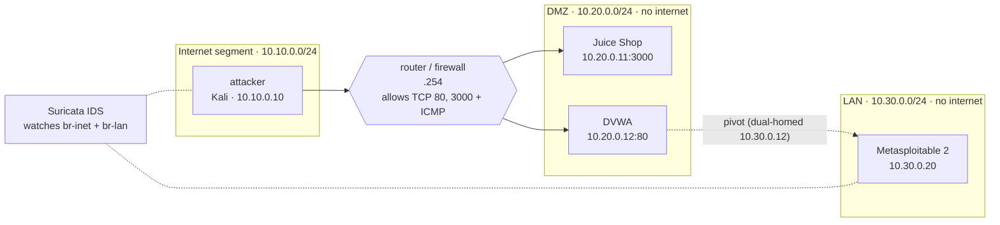

# CyberLab — Hands-On Labs

Eighteen hands-on labs that take students through a full offensive-and-defensive workflow, from reconnaissance to post-exploitation and hardening. Each lab is a self-contained handout with objectives, steps and a deliverable.

Every lab runs against the isolated [CyberLab range](../README.md) (or an equivalent Kali + targets setup). Use the tools **only against the lab targets** — see the [Acceptable Use Policy](../ACCEPTABLE_USE.md).

> Labs are Word documents so instructors can adapt them. GitHub doesn't preview `.docx` in the browser — click a lab, then **Download** or **View raw** to open it.

## Network topology

The labs run against the segmented range built by the [bootstrap scripts](../README.md). Three isolated networks sit behind a firewall router, with a Suricata IDS watching the traffic:



| Host | Role | Address | Used from |
|---|---|---|---|
| `attacker` | Kali (nmap, sqlmap, hydra, nuclei, Metasploit) | 10.10.0.10 | your attack shell |
| `router` | Firewall between Internet and DMZ | 10.10.0.254 / 10.20.0.254 | — |
| `juiceshop` | OWASP Juice Shop | 10.20.0.11:3000 | web-exploitation labs |
| `dvwa` | DVWA, dual-homed pivot into the LAN | 10.20.0.12 / 10.30.0.12 | web + pivoting labs |
| `metasploitable` | Metasploitable 2 (legacy services) | 10.30.0.20 | network + exploitation labs |
| `suricata` | IDS (Emerging Threats Open rules) | host network | detection labs |

**Key rules the labs rely on:** the DMZ and LAN have **no internet access**; the router lets the attacker reach only the DMZ web ports (80, 3000); and the LAN is reachable **only by pivoting through the dual-homed DVWA host**. Those constraints are what Labs 6–7, 12 and 15–16 exercise.

## How to use CyberLab

These addresses are **fixed**, so every lab handout can name them directly. A typical lab session:

**1. Start the range and confirm it's healthy** (on the lab host):

```bash
cyberlab up        # start every container and load IDS rules
cyberlab verify    # expect "All checks passed."
cyberlab status    # see what's running
```

**2. Open an attack shell** — most command-line steps run here:

```bash
docker exec -it attacker bash
nmap -sV 10.20.0.0/24        # e.g. discover the DMZ
```

**3. Reach the web targets in a browser** — set the browser to use the SOCKS5 proxy at `127.0.0.1:1080`, then open `http://10.20.0.11:3000` (Juice Shop) or `http://10.20.0.12` (DVWA).

**4. Watch the defender's side** — in a second terminal, tail the live IDS alerts while you attack:

```bash
cyberlab alerts
```

**5. Reset between students or labs** — return the range to a clean, identical baseline:

```bash
cyberlab reset --full        # wipe containers and volumes, then restart
cyberlab verify
```

The full command reference is in the [main README](../README.md#managing-the-lab-the-cyberlab-command). Each lab handout lists the specific hosts, tools and deliverable for that exercise.

## Lab index

| # | Lab | Track | NICE work role |
|---|---|---|---|
| 1 | [DNS Footprinting](Lab-01-DNS-Footprinting.docx) | Reconnaissance | Vulnerability Analysis (PD-WRL-007) |
| 2 | [Packet Crafting with Scapy](Lab-02-Packet-Crafting-with-Scapy.docx) | Reconnaissance | Vulnerability Analysis (PD-WRL-007) |
| 3 | [Reconnaissance with Nmap Zenmap and Masscan](Lab-03-Reconnaissance-with-Nmap-Zenmap-and-Masscan.docx) | Reconnaissance | Vulnerability Analysis (PD-WRL-007) |
| 4 | [Reconnaissance with hping](Lab-04-Reconnaissance-with-hping.docx) | Reconnaissance | Vulnerability Analysis (PD-WRL-007) |
| 5 | [Vulnerability Scanning with OpenVAS](Lab-05-Vulnerability-Scanning-with-OpenVAS.docx) | Vulnerability Assessment | Vulnerability Analysis (PD-WRL-007) |
| 6 | [Network Analysis](Lab-06-Network-Analysis.docx) | Traffic & Detection | Cyber Defense Analysis (PD-WRL-001) |
| 7 | [Evading IDS](Lab-07-Evading-IDS.docx) | Traffic & Detection | Cyber Defense Analysis (PD-WRL-001) |
| 8 | [Password Cracking with John the Ripper and Hashcat](Lab-08-Password-Cracking-with-John-the-Ripper-and-Hashcat.docx) | Exploitation | Exploitation Analysis (PD-WRL-003) |
| 9 | [Metasploit Framework Fundamentals and Armitage](Lab-09-Metasploit-Framework-Fundamentals-and-Armitage.docx) | Exploitation | Exploitation Analysis (PD-WRL-003) |
| 10 | [Web Pentesting](Lab-10-Web-Pentesting.docx) | Web Exploitation | Exploitation Analysis (PD-WRL-003) |
| 11 | [Client-Side Exploitation with BeEF](Lab-11-Client-Side-Exploitation-with-BeEF.docx) | Web Exploitation | Exploitation Analysis (PD-WRL-003) |
| 12 | [ARP Spoofing and Man-in-the-Middle Attacks](Lab-12-ARP-Spoofing-and-Man-in-the-Middle-Attacks.docx) | Network Attacks | Exploitation Analysis (PD-WRL-003) |
| 13 | [Understanding Buffer Overflows](Lab-13-Understanding-Buffer-Overflows.docx) | Exploitation | Exploitation Analysis (PD-WRL-003) |
| 14 | [Understanding SQL Commands and Injections](Lab-14-Understanding-SQL-Commands-and-Injections.docx) | Web Exploitation | Exploitation Analysis (PD-WRL-003) |
| 15 | [Backdooring with Netcat](Lab-15-Backdooring-with-Netcat.docx) | Post-Exploitation | Exploitation Analysis (PD-WRL-003) |
| 16 | [VNC as a Backdoor](Lab-16-VNC-as-a-Backdoor.docx) | Post-Exploitation | Exploitation Analysis (PD-WRL-003) |
| 17 | [Creating and Installing SSL Certificates](Lab-17-Creating-and-Installing-SSL-Certificates.docx) | Defense & Hardening | Cyber Defense Analysis (PD-WRL-001) |
| 18 | [Social Engineering Attacks with the Social-Engineer Toolkit](Lab-18-Social-Engineering-Attacks-with-the-Social-Engineer-Toolkit.docx) | Social Engineering | Exploitation Analysis (PD-WRL-003) |

## Suggested sequence

| Track | Labs | Focus |
|---|---|---|
| Reconnaissance | 1–4 | Footprinting, packet crafting, scanning |
| Vulnerability assessment | 5 | Authenticated and unauthenticated scanning |
| Traffic & detection | 6–7 | Packet analysis, IDS evasion and detection |
| Exploitation | 8–9, 13 | Credential attacks, Metasploit, buffer overflows |
| Web exploitation | 10–11, 14 | Web app attacks, client-side, SQL injection |
| Network attacks | 12 | ARP spoofing and man-in-the-middle |
| Post-exploitation | 15–16 | Backdoors and persistence |
| Defense & hardening | 17 | Certificates and transport security |
| Social engineering | 18 | Human-layer attacks and awareness |

## NICE Framework coverage

These labs develop competencies across four NICE Workforce Framework (SP 800-181 Rev. 1) work roles:

- **Vulnerability Analysis** (PD-WRL-007) — Labs 1–5
- **Cyber Defense Analysis** (PD-WRL-001) — Labs 6–7, 17
- **Exploitation Analysis** (PD-WRL-003) — Labs 8–16, 18
