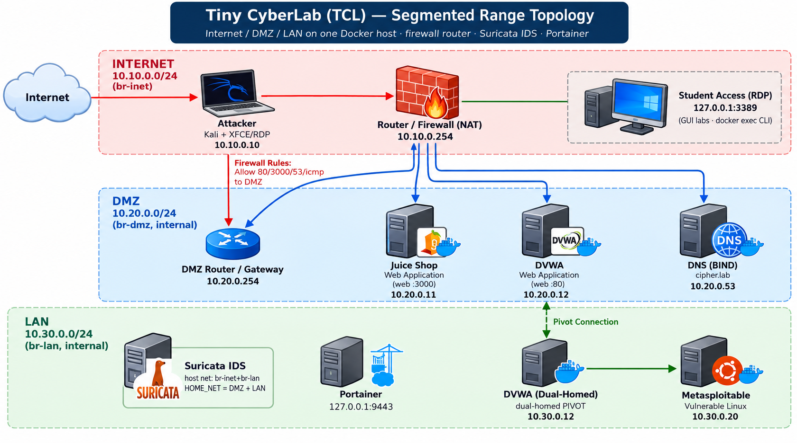

# Tiny CyberLab (TCL)

**A small, reproducible, Docker-based cyber range for hands-on cybersecurity
education — designed to close the cybersecurity skills gap in higher education
through project-based and experiential learning.**



Tiny CyberLab (TCL) runs an entire attack-and-defend teaching range as a handful
of Docker containers on a **single Linux host** (a Kali or Ubuntu Server VM in
Oracle VirtualBox). Instead of one flat network, the range is **segmented into
three zones — Internet, DMZ, and an internal LAN — behind a firewall router**, so
students practise realistic skills like working through a firewall and pivoting to
reach an internal host. A student needs only an RDP client or a terminal to
complete a full penetration-testing curriculum. Each student uses one lightweight
host (a VirtualBox VM, a cloud instance or a VPS), or an instructor can run isolated
copies for up to 10 students on one Proxmox server. No specialized hardware is needed.

TCL ships with **30 ready-to-run labs** mapped to the
[NICE Workforce Framework for Cybersecurity](https://niccs.cisa.gov/workforce-development/nice-framework)
(NIST SP 800-181 Rev. 1), spanning reconnaissance, scanning, vulnerability
analysis, exploitation, post-exploitation, and defensive analysis.

> ⚠️ **For authorized, contained lab use only.** TCL installs real offensive
> security tooling. Read [DISCLAIMER.md](DISCLAIMER.md) before you deploy it.

---

## Why TCL exists (research context)

Cybersecurity programs struggle to give students authentic, hands-on practice:
commercial ranges are expensive, cloud ranges incur recurring cost, and
VM-per-student labs are heavy to build and maintain. TCL is the artifact of a
research effort asking a simple question:

> *Can a cyber range small and cheap enough to run on one laptop still deliver
> the authentic, project-based experience that builds workforce-ready skills?*

TCL is built around three learning frameworks:

- **Problem-Based Learning (PBL)** — each lab is an ill-structured, realistic
  task (a client engagement), not a copy-paste script.
- **Experiential learning (Kolb's cycle)** — students do, observe, conceptualize,
  and experiment, then write up findings.
- **NICE Framework alignment** — every lab maps to a recognized work role so
  classroom activity ties directly to employer-recognized competencies.

See [`docs/research-context.md`](docs/research-context.md) for the problem
statement, approach, contribution, and evaluation plan.

---

## What's in the box

| Component | Description |
| --- | --- |
| `range/` | The reference topology: `docker-compose.yml`, the attacker image, and a BIND zone. |
| `docs/` | Topology diagram, architecture, deployment guides, instructor guide, student quick-start, NICE mapping, research context, an optional CAI (AI pentest agent) add-on, and the Instructor Resource Kit. |
| `docs/InstructorKit.7z` | Instructor Resource Kit (encrypted): the 30 lab exercises (.docx), NICE-mapped, with a deliverable and rubric cues. See [how to request the key](docs/Instructor%20Resources%20Kit.txt). |

### The range

| Zone | Host | IP (reference) | Role |
| --- | --- | --- | --- |
| Internet `10.10.0.0/24` | `attacker` | 10.10.0.10 | Kali toolset + XFCE desktop over RDP (every lab) |
| Internet / DMZ | `router` | 10.10.0.254 · 10.20.0.254 | Firewall / NAT between the zones |
| DMZ `10.20.0.0/24` | `juiceshop` | 10.20.0.11 | OWASP Juice Shop (web labs) |
| DMZ | `dvwa` | 10.20.0.12 · 10.30.0.12 | DVWA — **dual-homed LAN pivot** (web / SQLi labs) |
| DMZ | `dns` | 10.20.0.53 | BIND, authoritative for `cipher.lab` (Lab 1) |
| LAN `10.30.0.0/24` | `metasploitable` | 10.30.0.20 | Metasploitable 2 (exploitation, enumeration, backdoors) |
| host network | `suricata` | br-inet + br-lan | Suricata IDS sensor (IDS-evasion lab) |
| host-only | `portainer` | 127.0.0.1:9443 | Container management GUI |

The attacker sits on the **Internet** segment. The **firewall router** forwards
only web ports (80/3000), DNS (53), and ICMP into the **DMZ**; the **LAN** has no
route in and is reachable only by **pivoting through the dual-homed `dvwa`**. The
labs use a fictional engagement — **Summit Cyber Group** (the consultancy the
student works for) assessing **Cipher Logistics** (the client) — purely as
narrative framing. An optional CAI (AI pentest agent) container can be added — see
[`docs/add-cai-container.md`](docs/add-cai-container.md).

---

## Quick start

> Prerequisites: an Ubuntu Server VM in VirtualBox with Docker Engine + the
> Compose plugin. See [`docs/instructor-guide.md`](docs/instructor-guide.md).

```bash
git clone https://github.com/ielhadad/cyberlab.git
cd cyberlab/range
docker compose build attacker      # large image (desktop + tools); first build is slow
docker compose up -d
docker ps                          # confirm names/IPs
```

**Access the attacker workstation** (from the lab host):

| Method | Address | Use |
| --- | --- | --- |
| RDP desktop | `127.0.0.1:3389` (root / cyberrange) | GUI labs (Zenmap, Armitage, Burp, Wireshark, Ettercap) |
| Terminal | `docker exec -it attacker bash` | CLI labs |

> Remote students reach RDP through an SSH tunnel to `127.0.0.1:3389`. Keep RDP
> bound to `127.0.0.1` and never expose it to a campus network or the public internet.

See [`docs/student-quickstart.md`](docs/student-quickstart.md) for the
student-facing version, including the **pivoting primer** for the LAN labs.

---

## Documentation

All guides live in [`docs/`](docs/):

**Start here**
- [Deployment guides for all environments](docs/deploy/README.md) — VirtualBox, AWS, AWS Academy, Azure, VPS and Proxmox
- [Deployment Runbook (PDF)](docs/VBox%20Deployment%20Runbook.pdf) — full teacher + student walkthrough for VirtualBox and AWS
- [Deployment checklist](docs/deploy-checklist.md) — one-page, tick-as-you-go setup
- [Quick reference (PDF)](docs/CyberLab%20Quick%20Reference.pdf) — one-screen cheat sheet

**For students**
- [Student quick-start](docs/student-quickstart.md)
- [Student step-by-step guide](docs/student-guide.md) — includes the pivoting primer

**For instructors**
- [Instructor guide](docs/instructor-guide.md)
- [AWS EC2 deployment guide](docs/deploy-aws-ec2.md)
- [Add the optional CAI agent](docs/add-cai-container.md)

**Reference**
- [Architecture](docs/architecture.md)
- [NICE Framework mapping](docs/nice-framework-mapping.md)
- [Research context](docs/research-context.md)

---

## The 30 labs

The lab documents are distributed to instructors in the Instructor Resource Kit
([request the key](docs/Instructor%20Resources%20Kit.txt)); their NICE alignment is in
[docs/nice-framework-mapping.md](docs/nice-framework-mapping.md). In short: DNS
reconnaissance, packet crafting, Nmap/Masscan recon, hping, OpenVAS, network
analysis, IDS evasion, password cracking, Metasploit, web pentesting, BeEF,
ARP/MITM, buffer overflows, SQL injection, Netcat and VNC backdoors, TLS
certificates, social engineering with SET, scanning methodology, SMB
enumeration, privilege escalation, Windows SAM cracking, covering tracks,
web cookie forgery, Android hacking, command-line cryptography, incident response,
digital forensics, Linux command-line essentials, and Suricata log and traffic
analysis. Each lab
ships with three tracks — **Guided**, **Unguided**, and **Capture-the-Flag**.

---

## Using TCL in your course

TCL is released so other educators and researchers can run, adapt, and extend
it. You are encouraged to fork it, swap the fictional client, re-map labs to
your syllabus, and contribute improvements back. See
[CONTRIBUTING.md](CONTRIBUTING.md).

---

## Citing this work

If you use TCL in teaching or research, please cite it as:

> Elhadad, S. (2026). *Tiny CyberLab (TCL): A reproducible Docker-based cyber
> range for project-based cybersecurity education.* Capital Community College.
> https://github.com/ielhadad/cyberlab

---

## Publications & related work

Selected publications by the author related to cybersecurity education and cyber
ranges. <!-- TODO: replace the placeholders below with your real titles, venues, years, and links. -->

- [Publication title 1] — _[Venue], [Year]._ [link](#)
- [Publication title 2] — _[Venue], [Year]._ [link](#)
- [Publication title 3] — _[Venue], [Year]._ [link](#)

<!-- Add or remove entries as needed. -->

---

## License

- **Code and configuration** (`range/`, scripts, CI): [MIT](LICENSE).
- **Lab content and documentation** (Instructor Resource Kit, `docs/`): [CC BY 4.0](LICENSE-docs).

This dual-license lets anyone reuse the infrastructure freely while requiring
attribution for the teaching materials. Prefer copyleft? Swap `LICENSE` for
GPL-3.0 and this section accordingly.

## Acknowledgments

Built on open-source projects including Kali Linux, OWASP Juice Shop, DVWA,
Metasploitable, BIND, Suricata, Portainer, and the many tools the labs exercise.
Lab design aligns with the NIST/NICE Workforce Framework for Cybersecurity.
