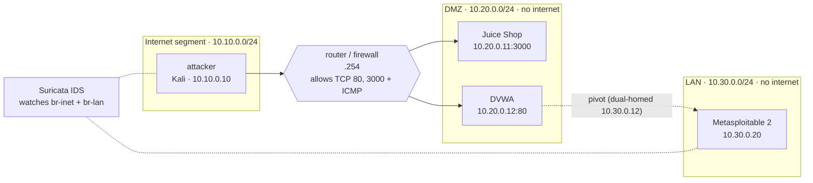

# cyberlab
Open-source cyber range for hands-on cybersecurity courses. One script builds an isolated network on VirtualBox or AWS EC2: Kali attacker, firewalled DMZ (Juice Shop, DVWA), pivot-only LAN (Metasploitable) and Suricata IDS. Built-in self-test and one-step reset support project-based learning mapped to NICE Framework roles.
# CyberLab

**A segmented, one-command cyber range for hands-on security education.**

CyberLab builds a small, realistic network on a single Linux host: an attacker, a firewalled DMZ, an internal LAN reachable only by pivoting, and a Suricata IDS watching the traffic. One script installs everything. One command resets it to a clean baseline, so every student starts from the same, verified state.

It is designed for project-based and experiential learning in higher education: students attack, pivot, detect, and defend in a range that costs nothing on a laptop and a few dollars a month in the cloud.

> [!WARNING]
> CyberLab runs **intentionally vulnerable software** (DVWA, OWASP Juice Shop, Metasploitable 2). Run it only on a machine you control. Never expose the lab networks to the internet or a campus network. Read the [Acceptable Use Policy](ACCEPTABLE_USE.md) and [SECURITY.md](SECURITY.md) before you start.

---

## Topology



| Container | Role | Address |
|---|---|---|
| `attacker` | Kali with nmap, sqlmap, hydra, nuclei | 10.10.0.10 |
| `router` | Firewall between Internet and DMZ (only web ports pass) | 10.10.0.254 / 10.20.0.254 |
| `juiceshop` | OWASP Juice Shop (modern web app) | 10.20.0.11 |
| `dvwa` | DVWA, dual-homed: the only way into the LAN | 10.20.0.12 / 10.30.0.12 |
| `metasploitable` | Metasploitable 2 (legacy services) | 10.30.0.20 |
| `suricata` | IDS with Emerging Threats Open rules | host network |
| `portainer` | Web GUI for the containers | `127.0.0.1:9443` only |
| `socks` | Optional SOCKS5 proxy so a host browser can reach the DMZ as the attacker | `127.0.0.1:1080` only |

Nothing is published on a public interface.

---

## Choose a deployment

| | [VirtualBox (Kali VM)](docs/virtualbox.md) | [AWS EC2](docs/aws-ec2.md) |
|---|---|---|
| Script | `bootstrap-vbox.sh` | `bootstrap-aws-ec2.sh` |
| Best for | Students on their own laptops, offline use | Labs, remote students, low-spec laptops |
| Host | Kali Linux VM | Ubuntu 24.04 LTS instance (t3.large) |
| Cost | Free | Pay per hour; stop the instance when done |
| Extra hardening | None (local VM) | ufw (SSH only), fail2ban, automatic security updates, swap on small instances |
| Access | Directly in the VM | SSH, with tunnels for Portainer and the browser proxy |

Both scripts install the **same lab**. Only the host preparation differs.

---

## Quick start

**VirtualBox (inside a Kali VM):**

```bash
git clone https://github.com/ielhadad/cyberlab.git
cd cyberlab
sudo bash bootstrap-vbox.sh
```

**AWS EC2:** Paste the contents of `bootstrap-aws-ec2.sh` into **Advanced details → User data** when launching an Ubuntu 24.04 instance, or SSH in and run:

```bash
sudo bash bootstrap-aws-ec2.sh
```

The first run downloads about 3 GB and takes 10 to 20 minutes. Progress is logged to `/var/log/cyberlab-bootstrap.log`. It finishes by running the self-test. **Log out and back in** so your user can run Docker without `sudo`.

---

## Managing the lab: the `cyberlab` command

| Command | What it does |
|---|---|
| `cyberlab up` | Pull images, start the range, load IDS rules, print connection info |
| `cyberlab verify` | Self-test: segmentation, pivot path, IDS detection, localhost-only ports |
| `cyberlab status` | Show each container and whether it is running |
| `cyberlab alerts` | Tail Suricata's live alerts (the blue-team view) |
| `cyberlab rules` | Update the Suricata rule set |
| `cyberlab scan <url>` | Run a nuclei vulnerability scan from the attacker, e.g. `cyberlab scan http://10.20.0.12` |
| `cyberlab reset` | Rebuild all containers from clean images (keeps rules and logs) |
| `cyberlab reset --full` | Also wipe volumes: a clean baseline for the next student |
| `cyberlab down` | Stop the range (restart with `cyberlab up`) |
| `cyberlab destroy` | Remove containers, volumes and images |

A healthy lab ends `cyberlab verify` with **All checks passed.**

### First steps

```bash
docker exec -it attacker bash      # attack shell on the Internet segment
nmap -sV 10.20.0.0/24              # discover the DMZ
cyberlab alerts                    # in a second terminal: watch the IDS react
```

---

## Requirements

- A 64-bit Linux host: Kali, Debian, or Ubuntu (the bootstrap installs Docker Engine and Compose)
- 8 GB RAM recommended (the lab uses about 4.5 GB), 2 or more CPU cores, 30 GB free disk
- Internet access on first run to pull images and tools

---

## Educational context

CyberLab supports project-based, problem-based, and experiential learning: students work through a complete kill chain (reconnaissance, web exploitation, pivoting, lateral movement) and then switch to the defender's view with IDS alerts. Activities map naturally to NICE Framework work roles such as Vulnerability Analysis, Defensive Cybersecurity, and Incident Response.

---

## Roadmap

These deployment options exist in the full kit and will be published in later releases:

- Amazon Lightsail
- Low-cost KVM VPS providers
- Hetzner Cloud
- Proxmox VE (one pod per student)
- Lab guides and instructor runbooks

---

## Contributing

Bug reports and fixes from students and instructors are welcome. See [CONTRIBUTING.md](CONTRIBUTING.md).

## Citing CyberLab

If you use CyberLab in teaching or research, please cite it. GitHub shows a **Cite this repository** button generated from [CITATION.cff](CITATION.cff).

## License

- Code (scripts and compose configuration): [MIT](LICENSE)
- Documentation (`README.md`, `docs/`): [CC BY 4.0](LICENSE-docs)

Third-party images (Kali, DVWA, Juice Shop, Metasploitable, Suricata, Portainer) are pulled from their publishers and remain under their own licenses.
